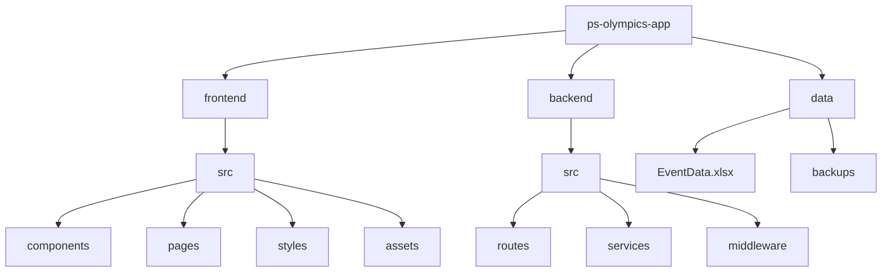
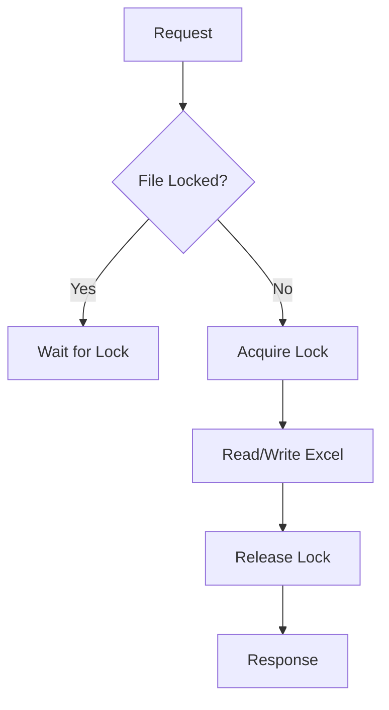

# Olympics Web Application Implementation Plan

## 1. Project Structure



## 2. Technical Stack

### Frontend

- Framework: React with TypeScript
- Routing: React Router v6
- Styling: Tailwind CSS
- State Management: React Query for server state
- Testing: Jest + React Testing Library

### Backend

- Runtime: Node.js
- Framework: Express.js with TypeScript
- Excel Handling: xlsx or exceljs library
- File Locking: proper-lockfile
- API Documentation: Swagger/OpenAPI

## 3. Implementation Phases

### Phase 1: Foundation Setup (1 week)

1. Project scaffolding
   - Create frontend using Create React App with TypeScript
   - Setup backend with Express + TypeScript
   - Configure ESLint, Prettier, and Git hooks
2. Excel data structure
   - Create EventData.xlsx with all required worksheets
   - Implement sample data as specified
3. Basic backend setup
   - Excel file read/write utilities
   - File locking mechanism
   - Error handling middleware

### Phase 2: Core Backend Development (2 weeks)

1. API Development

   ```mermaid
   graph LR
       A[API Routes] --> B[Excel Service]
       B --> C[File Lock]
       C --> D[EventData.xlsx]
   ```

   - Implement all CRUD endpoints for each worksheet
   - Add validation middleware
   - Setup proper error handling

2. Data Services
   - Excel read/write operations
   - Data transformation utilities
   - Caching layer for frequently accessed data

### Phase 3: Frontend Infrastructure (1 week)

1. Setup project structure
2. Configure routing
3. Implement shared components
4. Setup API client with React Query

### Phase 4: Frontend Features (3 weeks)

1. Homepage
2. Sports Section

   ```mermaid
   graph TB
       A[Sports Page] --> B[Sports Grid]
       B --> C[Sport Card]
       C --> D[Sport Detail Page]
       D --> E[Schedule Tab]
       D --> F[Results Tab]
       D --> G[Medals Tab]
   ```

3. Medal Table

   ```mermaid
   graph TB
       A[Medal Table] --> B[Sorting Logic]
       A --> C[Filter Component]
       A --> D[Team Stats]
       D --> E[Medal Counts]
       D --> F[Rankings]
   ```

4. Schedule & Results
5. Leaderboard

### Phase 5: Testing & Polish (1 week)

1. Unit tests
2. Integration tests
3. Performance optimization
4. Accessibility improvements

### Phase 6: Deployment Setup (1 week)

1. Server provisioning
2. CI/CD pipeline
3. SSL configuration
4. Backup system for Excel file

## 4. Key Technical Considerations

### Excel File Management



### Real-time Updates

1. Polling strategy for medal table
2. WebSocket consideration for live match updates

### Performance Optimization

1. Caching strategy for static data
2. Efficient Excel read/write operations
3. Frontend bundle optimization

## 5. Risk Mitigation

1. **Data Integrity**

   - Regular backups of EventData.xlsx
   - Validation before writes
   - File locking mechanism

2. **Performance**

   - Caching layer for frequently accessed data
   - Pagination for large datasets
   - Optimized Excel operations

3. **Scalability**
   - Consider migrating to a database if Excel becomes a bottleneck
   - Implement proper caching strategies
   - Monitor file size and operation times
