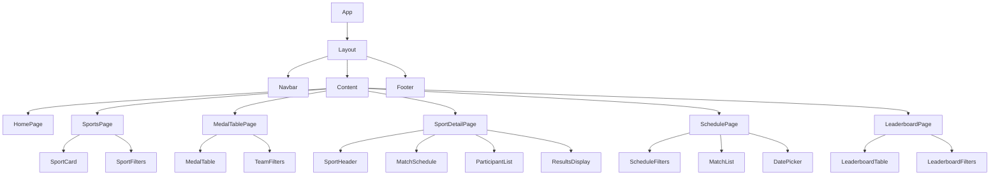

# PS-Olympics Frontend Architecture

## Technology Stack

- **Framework**: React 18 with TypeScript
- **State Management**: React Query + Context API
- **Styling**: Tailwind CSS + HeadlessUI
- **Routing**: React Router v6
- **Data Fetching**: Axios + React Query
- **Real-time**: WebSocket + Socket.io Client
- **Build Tool**: Vite
- **Testing**: Vitest + React Testing Library
- **Performance**: React.lazy() + Suspense

## Project Structure

```
src/
├── assets/              # Static assets (images, icons)
├── components/          # Reusable UI components
│   ├── common/         # Generic components
│   ├── sports/         # Sport-specific components
│   └── layout/         # Layout components
├── hooks/              # Custom React hooks
├── pages/              # Route components
├── services/           # API integration
├── stores/             # Global state management
├── types/              # TypeScript definitions
└── utils/              # Helper functions
```

## Component Hierarchy



## State Management

### Global State (Context)

```typescript
// User Context
interface UserContext {
  user: User | null;
  isAuthenticated: boolean;
  roles: string[];
  login: (credentials: Credentials) => Promise<void>;
  logout: () => void;
}

// Theme Context
interface ThemeContext {
  theme: "light" | "dark";
  toggleTheme: () => void;
}

// Real-time Context
interface RealtimeContext {
  connected: boolean;
  subscribe: (channel: string) => void;
  unsubscribe: (channel: string) => void;
}
```

### Data Fetching (React Query)

```typescript
// Example query hooks
const useSportsList = () => {
  return useQuery(["sports"], fetchSports, {
    staleTime: 5 * 60 * 1000, // 5 minutes
    cacheTime: 30 * 60 * 1000, // 30 minutes
  });
};

const useMedalTable = () => {
  return useQuery(["medals"], fetchMedalStandings, {
    staleTime: 60 * 1000, // 1 minute
    refetchInterval: 60 * 1000, // Real-time updates backup
  });
};
```

## Real-time Updates

### WebSocket Integration

```typescript
// hooks/useWebSocket.ts
const useWebSocket = () => {
  const socket = useSocket();

  useEffect(() => {
    socket.on("score_update", handleScoreUpdate);
    socket.on("medal_update", handleMedalUpdate);

    return () => {
      socket.off("score_update");
      socket.off("medal_update");
    };
  }, []);

  // Additional WebSocket logic...
};
```

## Reusable Components

### Common Components

```typescript
// components/common/Button.tsx
interface ButtonProps {
  variant: "primary" | "secondary" | "outline";
  size: "sm" | "md" | "lg";
  loading?: boolean;
  disabled?: boolean;
}

// components/common/Card.tsx
interface CardProps {
  elevation?: "none" | "sm" | "md" | "lg";
  interactive?: boolean;
}

// components/common/Badge.tsx
interface BadgeProps {
  type: "gold" | "silver" | "bronze" | "info";
  pulse?: boolean;
}
```

### Sport-specific Components

```typescript
// components/sports/CricketScorecard.tsx
interface CricketScorecardProps {
  matchId: string;
  inningsData: InningsData[];
  live?: boolean;
}

// components/sports/ChessBoard.tsx
interface ChessBoardProps {
  fen: string;
  onMove?: (move: string) => void;
  viewOnly?: boolean;
}
```

## Page Components

### Home Page

```typescript
// pages/HomePage.tsx
const HomePage = () => {
  const { featuredSports } = useFeaturedSports();
  const { upcomingMatches } = useUpcomingMatches();
  const { recentResults } = useRecentResults();

  return (
    <div>
      <HeroSection />
      <FeaturedSportsGrid sports={featuredSports} />
      <UpcomingMatchesCarousel matches={upcomingMatches} />
      <RecentResultsList results={recentResults} />
    </div>
  );
};
```

### Medal Table Page

```typescript
// pages/MedalTablePage.tsx
const MedalTablePage = () => {
  const { data, isLoading } = useMedalTable();
  const [filters, setFilters] = useState<MedalFilters>({});

  return (
    <div>
      <MedalTableFilters onFilterChange={setFilters} currentFilters={filters} />
      {isLoading ? (
        <TableSkeleton />
      ) : (
        <MedalTable data={data} filters={filters} />
      )}
    </div>
  );
};
```

## Performance Optimizations

### Code Splitting

```typescript
// App.tsx
const HomePage = lazy(() => import("./pages/HomePage"));
const SportDetailPage = lazy(() => import("./pages/SportDetailPage"));

// Wrap in Suspense
<Suspense fallback={<LoadingSpinner />}>
  <Routes>
    <Route path="/" element={<HomePage />} />
    <Route path="/sports/:id" element={<SportDetailPage />} />
  </Routes>
</Suspense>;
```

### Virtualization

```typescript
// components/MatchList.tsx
import { VirtualizedList } from "react-virtualized";

const MatchList = ({ matches }) => {
  return (
    <VirtualizedList
      width={width}
      height={height}
      rowCount={matches.length}
      rowHeight={100}
      rowRenderer={({ index, style }) => (
        <MatchCard
          key={matches[index].id}
          match={matches[index]}
          style={style}
        />
      )}
    />
  );
};
```

### Memoization

```typescript
// components/MedalRow.tsx
const MedalRow = memo(
  ({ team, medals }) => {
    return (
      <tr>
        <td>{team.name}</td>
        <td>{medals.gold}</td>
        <td>{medals.silver}</td>
        <td>{medals.bronze}</td>
      </tr>
    );
  },
  (prev, next) => {
    return isEqual(prev.medals, next.medals);
  }
);
```

## Error Handling

```typescript
// components/ErrorBoundary.tsx
class ErrorBoundary extends React.Component {
  state = { hasError: false };

  static getDerivedStateFromError(error) {
    return { hasError: true };
  }

  render() {
    if (this.state.hasError) {
      return (
        <ErrorFallback onReset={() => this.setState({ hasError: false })} />
      );
    }
    return this.props.children;
  }
}
```

## Responsive Design

```typescript
// tailwind.config.js
module.exports = {
  theme: {
    screens: {
      sm: "640px",
      md: "768px",
      lg: "1024px",
      xl: "1280px",
      "2xl": "1536px",
    },
  },
};

// Example responsive component
const SportGrid = styled.div`
  display: grid;
  grid-template-columns: repeat(1, 1fr);
  gap: 1rem;

  @screen sm {
    grid-template-columns: repeat(2, 1fr);
  }

  @screen lg {
    grid-template-columns: repeat(4, 1fr);
  }
`;
```

## Testing Strategy

```typescript
// Example test file
import { render, screen, fireEvent } from "@testing-library/react";
import { MedalTable } from "./MedalTable";

describe("MedalTable", () => {
  it("sorts teams by gold medals by default", () => {
    render(<MedalTable teams={mockTeams} />);
    const rows = screen.getAllByRole("row");
    expect(rows[1]).toHaveTextContent("Team A");
  });

  it("filters teams by country", () => {
    render(<MedalTable teams={mockTeams} />);
    const filterInput = screen.getByPlaceholderText("Filter by country");
    fireEvent.change(filterInput, { target: { value: "India" } });
    expect(screen.getAllByRole("row")).toHaveLength(2);
  });
});
```
