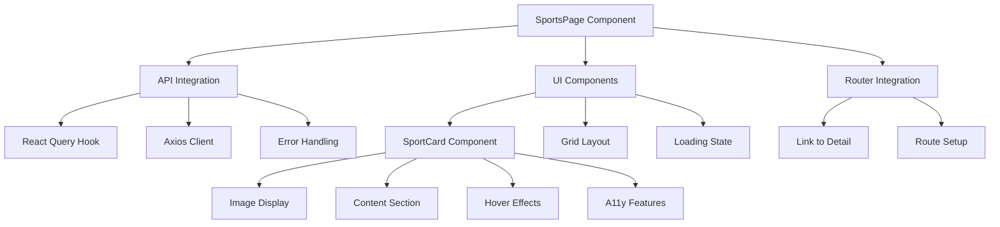

# Sports Page Implementation Plan

## Overview

This document outlines the implementation plan for the PS Olympics Sports page, which displays a grid of sport cards fetched from the `/api/v1/sports` endpoint.

## Component Architecture



## Implementation Details

### 1. API Integration Layer

```typescript
// hooks/useSports.ts
const useSports = () => {
  return useQuery({
    queryKey: ["sports"],
    queryFn: () => axios.get("/api/v1/sports"),
    staleTime: 5 * 60 * 1000, // 5 minutes
  });
};
```

### 2. Component Structure

#### SportCard Component

```typescript
// components/sports/SportCard.tsx
interface SportCardProps {
  sport: {
    id: number;
    name: string;
    description: string;
    icon_url: string;
  };
}
```

### 3. Required Changes

1. **API Integration**

   - Replace hardcoded sports data with API call
   - Implement React Query for data fetching
   - Add error handling and loading states

2. **UI Components**

   - Create reusable SportCard component
   - Implement responsive grid layout
   - Add loading skeleton components
   - Enhance hover effects and transitions

3. **Accessibility Features**

   - Add proper ARIA roles and labels
   - Implement keyboard navigation
   - Include appropriate alt text for images
   - Ensure proper focus management

4. **Responsive Design**

   - Mobile: 1 card per row
   - Tablet: 2 cards per row
   - Desktop: 3-4 cards per row
   - Flexible grid spacing
   - Responsive typography

5. **Performance Optimizations**
   - Image optimization for icons
   - Proper caching with React Query
   - Implement loading skeletons
   - Add error boundaries

### 4. Technical Specifications

1. **Grid Layout**

   ```tsx
   <div className="grid gap-6 sm:grid-cols-1 md:grid-cols-2 lg:grid-cols-3 xl:grid-cols-4">
   ```

2. **Card Styling**

   - Shadow on hover
   - Smooth transitions
   - Truncated description (~100 chars)
   - Consistent card heights

3. **Data Types**

   ```typescript
   interface Sport {
     id: number;
     name: string;
     description: string;
     icon_url: string;
     type: string;
     max_players_per_team: number;
   }
   ```

4. **Loading State**
   - Skeleton cards with pulsing effect
   - Maintain grid layout during loading
   - Smooth transition when data loads

## Testing Strategy

1. **Unit Tests**

   - Sport card component rendering
   - Description truncation
   - Hover effects
   - API integration

2. **Integration Tests**
   - Grid layout responsiveness
   - Navigation to detail page
   - Error state handling
   - Loading state behavior

## Success Criteria

1. Successful API integration with proper error handling
2. Responsive grid layout across all device sizes
3. Accessible to keyboard and screen readers
4. Smooth loading and error states
5. Proper navigation to sport detail pages
6. Performance metrics within acceptable ranges

## Next Steps

1. Switch to Code mode for implementation
2. Create necessary components and hooks
3. Implement API integration
4. Add styling and responsive design
5. Test across different devices and scenarios
